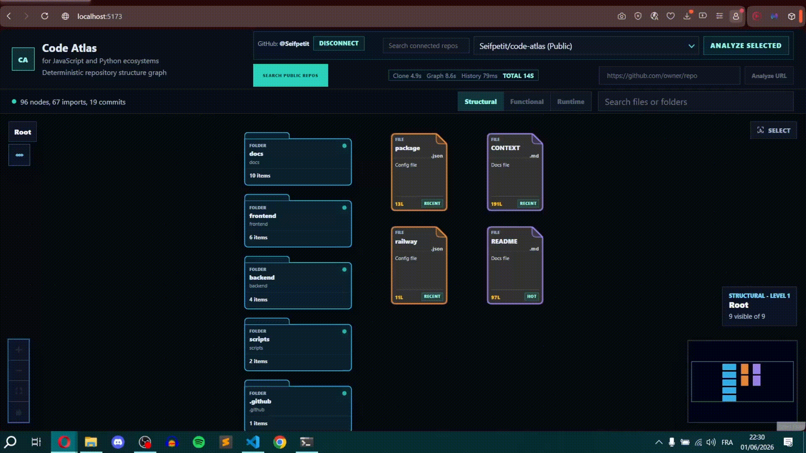
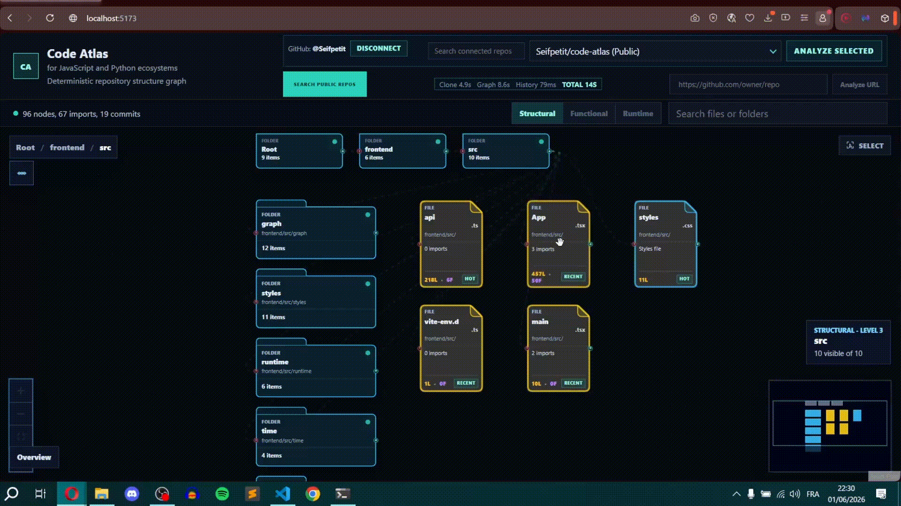
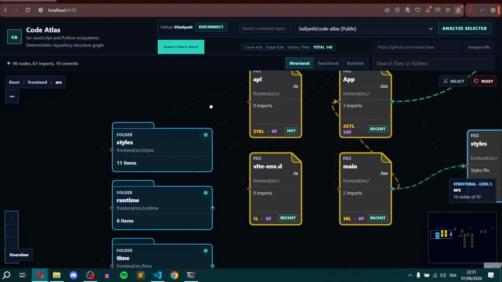
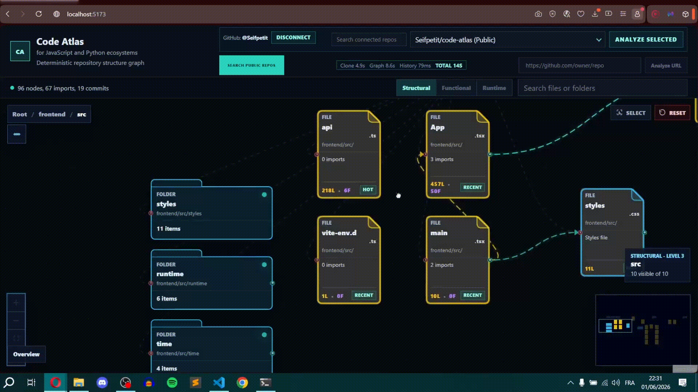
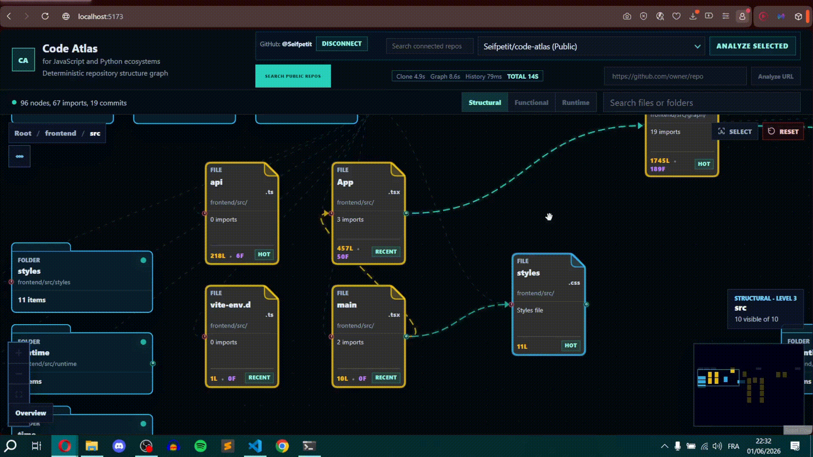

# Code Atlas

**You make better decisions in a codebase when you can see the full picture without being overwhelmed by it.**

→ Live: [code-atlas.up.railway.app](https://code-atlas.up.railway.app)
→ Stack: Node.js · Express · React · React Flow · TypeScript · Docker · Railway

---

<!-- DEMO GIF — main canvas, navigating the graph -->


---

## Why this exists

I'm a student learning how to work inside large codebases from scratch. The first question you ask when onboarding a new repo isn't technical — it's spatial. *Where do I even look first?*

Dumping everything at once seems smart, but it isn't. It creates noise, not clarity. You end up with a diagram you can read but don't trust, because you didn't build the mental model yourself — it was handed to you.

Code Atlas is built around a different idea: **clarity emerges from interactivity**. You don't get the full picture upfront. You reveal it by navigating — clicking what matters to you, following the connections that make sense in context, building a mental map you actually own.

The result is confidence. Not just understanding what a file does, but feeling certain enough to act on it.

---

## How it works

Point Code Atlas at any GitHub repository. It clones it, parses the file structure and import relationships using AST analysis, and generates an interactive spatial graph — no LLMs, no embeddings, fully deterministic. The same repo always produces the same graph.

Analysis time depends on repo size:
- Code Atlas itself → ~15s
- facebook/react → ~4min

**Three ways to get started:**
- Search a public repo — good for studying open source projects
- Paste any public GitHub URL
- Connect your GitHub account and select from your own repos

---

## What you can do with it

The core design principle is what I call an **intent wall**: nothing is shown to you that you didn't ask for. The interface responds to where you click, what you focus on, and how deep you choose to go. Complexity is always there — it just stays hidden until you're ready for it.

---

### Navigate the graph

The canvas starts at the root of the repository. Folders and files are nodes, connections are import relationships. Drill down by clicking into any folder — each level reveals only the current context and its immediate neighbors.

At a glance you can already read the codebase topology: files with many inbound connections are load-bearing, files with none are safe leaves. No clicking required to see that.

<!-- GIF — canvas navigation, drilling into a folder, seeing the graph shift -->


---

### Inspect any file

Click a file and the metadata panel opens on the right. You see the stats that actually matter — lines, functions, imports, imported by — and a plain-language role: entry point, coordinator, shared utility, leaf.

The connectivity section shows every file this one imports and every file that imports it back. Each row is clickable. Click a dependency and the graph recenters around it.

If the target file lives in a different part of the graph, a bridge path is created — connecting your current position to the target through the actual import chain, recursively. You can reset at any moment and return to where you were.

<!-- GIF — clicking a file, metadata panel, clicking a dependency, graph recentering -->


---

### Follow the connections

Every file node has two handle dots — one on each side. Hover the left dot to reveal all files that import this one. Hover the right dot to reveal everything this file imports. The edges only appear on intent — keeping the canvas clean until you ask.

<!-- GIF — hovering handle dots, edges appearing, following a connection -->


---

### Read the source with context

Hit Inspect Source and the file opens in a split view — raw code on the right, a structured outline on the left grouped by imports, functions, and variables.

Click any row in the outline to jump to that line in the code. Variables are sorted by blast radius — the ones referenced most across the codebase float to the top, color-coded by scope. Before you read a single line of code you already know which variables are dangerous to touch and which ones are safe.

Expand any function and it reveals its runtime placement: the 1–2 functions that call into it, and the 1–2 functions it calls out to — with a count of remaining direct calls if there are more.

<!-- GIF — source inspector, clicking a function, blast radius variables -->


---

### Explore the timeline

The timeline view maps which files changed across commits. Select any commit to see what was touched, what shifted structurally, and where complexity has been accumulating over time.

<!-- GIF — timeline view, selecting a commit, files lighting up -->


---

## How it's built

No LLMs. No AI inference. Every node, every edge, every role classification comes from file system traversal, AST parsing, and static import analysis. Nothing is guessed. Nothing hallucinates.

Each analysis request clones the repo, extracts structure and imports, builds the graph, then discards the clone. No repository data is stored.

```
code-atlas/
├── backend/src/
│   ├── extractGraph.ts       AST parsing — JS/TS import resolution
│   ├── extractPython.ts      AST parsing — Python import resolution
│   ├── buildGraph.ts         graph assembly from extracted nodes
│   ├── cloneRepo.ts          temporary repo cloning + cleanup
│   ├── gitHistory.ts         commit history extraction
│   ├── gitDiff.ts            per-commit structural diff
│   ├── githubAuth.ts         OAuth + repo access
│   ├── server.ts             Express API + routes
│   └── types.ts              shared graph types
│
└── frontend/src/
    ├── App.tsx               root state + layout
    ├── api.ts                backend communication
    ├── graph/
    │   ├── GraphView.tsx         main canvas — React Flow
    │   ├── nodeTypes.tsx         file + folder node components
    │   ├── edgeTypes.tsx         connection edge components
    │   ├── layout.ts             spatial layout engine
    │   ├── SourceCodeModal.tsx   source inspector split view
    │   ├── sourceInspection.ts   outline parsing — functions, vars, imports
    │   ├── sourceSyntaxHighlighting.ts   code highlighting
    │   ├── filePalette.ts        file type color system
    │   ├── overlap.ts            node collision resolution
    │   └── attention/            focus + highlight state
    ├── runtime/
    │   ├── buildRuntimeChain.ts  execution path resolution
    │   ├── runtimeLayout.ts      runtime graph projection
    │   ├── RuntimeScrubber.tsx   runtime replay UI
    │   └── runtimeTypes.ts       runtime data types
    ├── history/
    │   ├── TimelinePanel.tsx     commit timeline UI
    │   └── historyUtils.ts       commit data helpers
    └── time/
        ├── TemporalScrubber.tsx  temporal navigation UI
        ├── temporalPressure.ts   file churn + hotspot scoring
        └── landmarkExtraction.ts structural change detection
```

---

## Run it yourself

```bash
git clone https://github.com/your-username/code-atlas
cd code-atlas
# add instructions here
```
