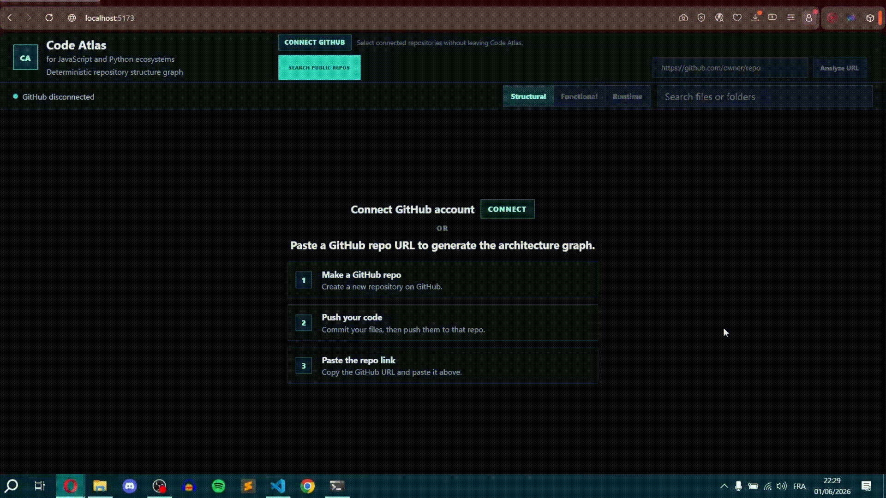
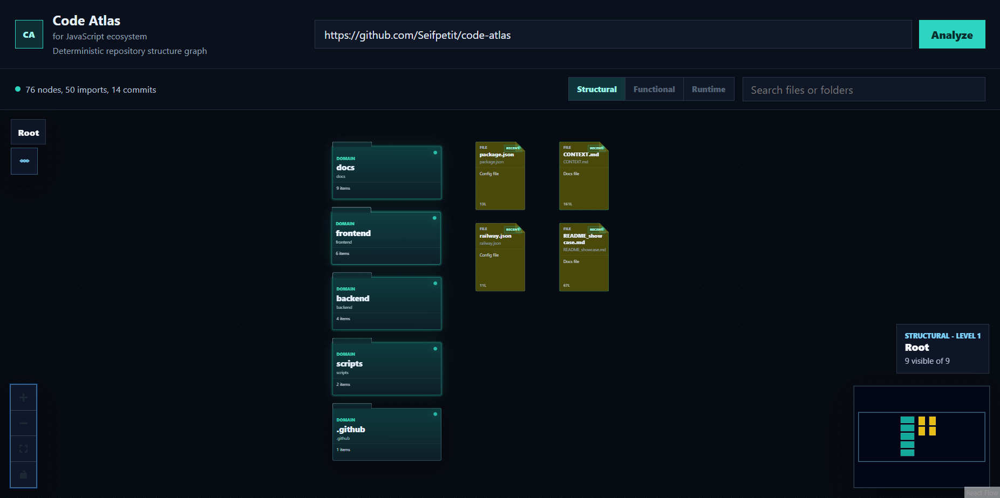
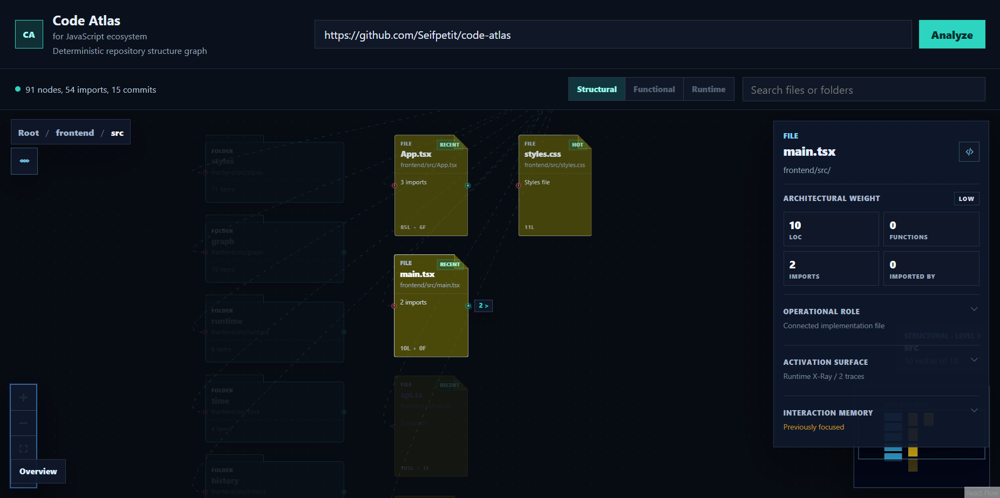
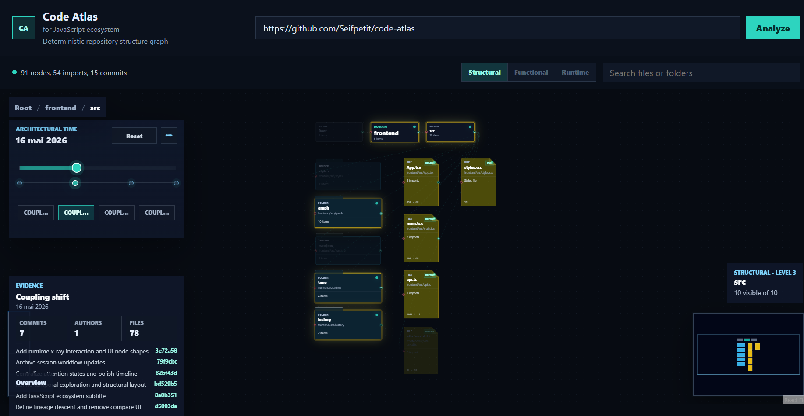
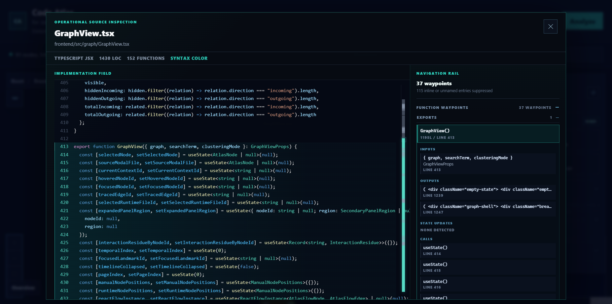

# Code Atlas

**An interactive system for exploring how a JavaScript codebase is structured, connected, and activated at runtime.**

→ Live: https://code-atlas.up.railway.app  
→ Stack: Node.js · Express · React · React Flow · TypeScript · Docker · Railway

---



---

## What it does

Paste a public GitHub repository URL.

Code Atlas clones the repository, analyzes its folder and file structure, resolves import relationships, and turns the result into an interactive spatial graph you can explore layer by layer.

The goal is to make large codebases easier to explore and understand without opening dozens of files manually.

Atlas helps visualize:
- how files connect
- what happens when the app runs
- which files are carrying the most complexity
- and how data moves between functions

---

## Screenshots

| Root view | Focused inspection |
|---|---|
|  |  |

| Timeline exploration | Context-preserving navigation |
|---|---|
|  |  |

---

## Core ideas

### Context-first navigation

Instead of rendering the entire repository at once, Atlas only reveals the current working context and its direct neighbors.

This keeps navigation readable even in larger repositories.

---

### Runtime X-Ray

Atlas can replay runtime activity paths through the graph so the repository feels less static and more operational.

The goal is to help developers understand:
- what activates first
- what gets triggered next
- and how activity propagates through the system

---

### Progressive inspection

Most graph tools expose every dependency at once, which quickly becomes visual noise.

Atlas only surfaces relationships around the currently focused object.

The interface progressively reveals deeper layers only when needed.

---

### Operational code inspection

Opening a file does not just show raw code.

The inspection modal exposes:
- function navigation
- inputs and outputs
- state updates
- connected calls
- runtime participation

This helps bridge the gap between:
architecture view → implementation view.

---

### Timeline exploration

Atlas includes a timeline view showing which files changed over time.

Commits can be selected directly from the interface to reveal:
- touched files
- structural changes
- evolving hotspots in the repository

---

## Technical decisions

### Deterministic graph generation

No LLMs or embeddings are used.

Every node and edge comes from:
- file system traversal
- AST parsing
- static import analysis

The graph is fully explainable and reproducible.

---

### Relation filtering

Dependency edges are hidden by default.

Only relationships around the currently focused object appear on screen.

This keeps the graph readable and avoids dependency-spaghetti visualization.

---

### Stateless analysis

Each analysis request:
1. clones the repository
2. extracts structure + imports
3. generates the graph
4. discards the clone

No repository data is persisted.

---

## Architecture

```text
code-atlas/
├── backend/          Express API — repo analysis + git history
│   ├── graph/        AST parsing + structure extraction
│   ├── git/          commit history + timeline metadata
│   └── routes/       analyze / diff / health
│
├── frontend/         React + React Flow
│   ├── graph/        layout engine + runtime projection
│   ├── nodes/        custom graph node types
│   ├── panels/       metadata, timeline, runtime inspection
│   └── state/        interaction + navigation state
│
└── Dockerfile        single-image deployment